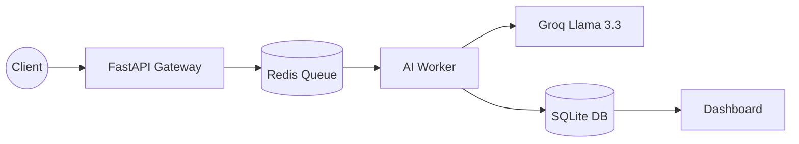

# SixGuard

SixGuard is an enterprise-grade, event-driven security monitoring platform.

## System Architecture

The following diagram illustrates the decoupled, asynchronous data flow:

## Key Technical Features

Asynchronous Processing: Decoupled design ensures AI analysis does not block the user.

Low-Latency AI: Hardware-accelerated Llama 3.3 for sub-second threat detection.

Scalable Queue: Redis-backed workers allow for horizontal scaling.