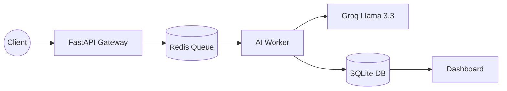

# SixGuard

SixGuard is an enterprise-grade, event-driven security monitoring platform.

## System Architecture

The following diagram illustrates the decoupled, asynchronous data flow:

## Key Technical Features

Asynchronous Processing: Decoupled design ensures AI analysis does not block the user.

Low-Latency AI: Hardware-accelerated Llama 3.3 for sub-second threat detection.

Scalable Queue: Redis-backed workers allow for horizontal scaling.

## Technical Implementation Details
Ingestion Layer: FastAPI endpoints optimized for low-latency JSON payload collection.

Message Broker: Redis utilized as the primary state store and task queue for distributed workload management.

Inference Engine: Asynchronous worker pattern designed to offload heavy Groq API calls from the main request-response cycle.

Persistence Layer: SQLite backend provides transactional integrity for security event logs.

## Deployment & Development
Containerization: Built with Docker to ensure environmental parity across dev, staging, and production environments.

CI/CD Pipeline: Automated validation triggered on every push to main via GitHub Actions, ensuring code quality and build integrity.