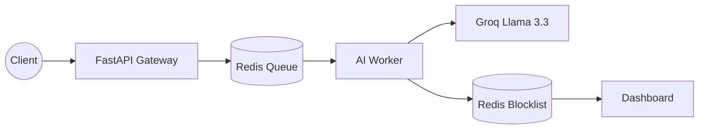

## SixGuard: Intelligent Real-Time Security Pipeline

SixGuard is an enterprise-grade, event-driven security monitoring platform that uses Large Language Models (LLMs) to perform context-aware threat detection in real-time. It is designed to act as a resilient middleware layer that intercepts traffic, analyzes malicious intent, and automates defensive actions.

## System Architecture

The following diagram illustrates the decoupled, asynchronous data flow:

## Key Technical Features

Asynchronous Processing: Decoupled design ensures high-throughput, non-blocking AI analysis.

Low-Latency AI: Hardware-accelerated Llama 3.3 for sub-second threat detection and payload introspection.

Scalable Infrastructure: Redis-backed worker pools allow for seamless horizontal scaling to meet traffic demands.

Security Command Center: A centralized, responsive dashboard providing real-time visibility into blocked IPs and threat telemetry.

Production Observability: Built-in logging, error handling, and audit trails for compliance and troubleshooting.

## Deployment Strategy

Prerequisites

Python 3.10+

Redis Server (local or managed instance)

Groq API Key

## Configuration

Create a .env file in the root directory and configure the following parameters:

GROQ_API_KEY=your_key_here
REDIS_HOST=localhost
REDIS_PORT=6379

## Execution

Dependency Installation:

pip install -r requirements.txt

Launch Services:

Worker Engine: python -m app.worker

API Gateway: python -m uvicorn app.main:app --reload

## Security Compliance & Governance

SixGuard follows the principle of "Fail-Safe Defaults." All detected threats are immediately propagated to the Redis blocklist, minimizing the exposure window for secondary attacks. The platform provides structured logs suitable for export to SIEM (Security Information and Event Management) tools.

## Contributing

We welcome contributions to strengthen our AI threat-detection prompts and pipeline robustness. Please ensure your code passes linting checks before submitting a Pull Request.

## License

SixGuard is licensed under the MIT License. See LICENSE for details.